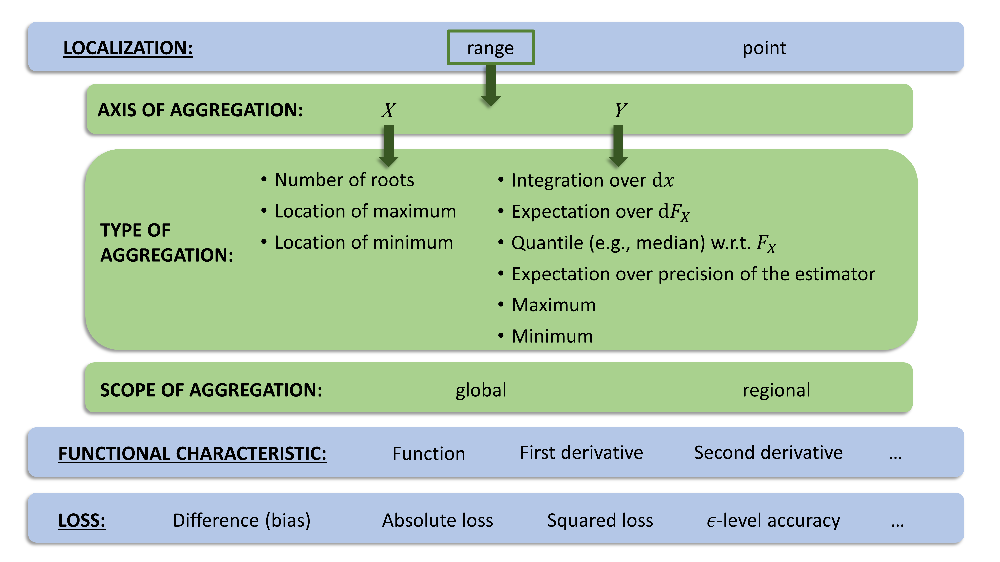
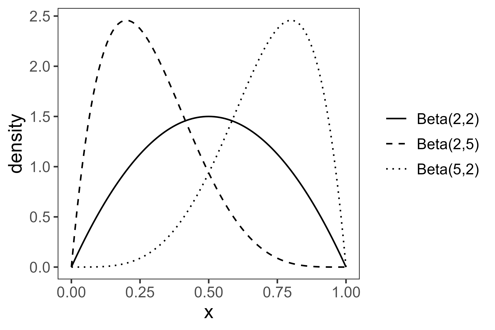
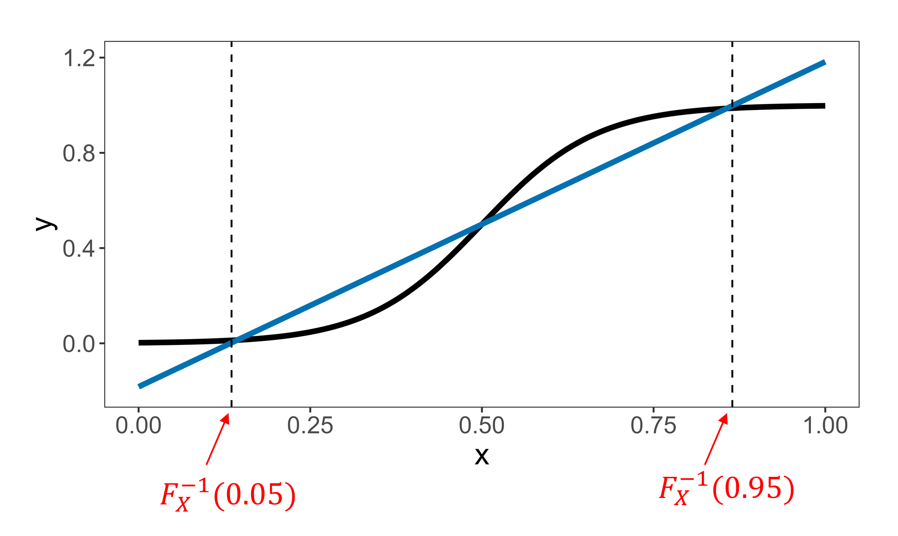

# Explanatory comments

This app illustrates the behavior of different performance measures for estimated non-linear associations with an outcome. Four examples are available in the app. Each example consists of a ground truth curve $f$ (in black color) and five "estimates" $\hat f$. Each performance measures assesses how similar $f$ and $\hat f$ are. Different measures differ in their definition of "similarity". In the accompanying manuscript, we categorized measures based on different aspects:

Each performance measure can be defined by a specific combination of these aspects.

The aspect *localization* distinguishes between measures that aggregate information over a *range* and measures that only take performance at a specific *point* $x^* \in \mathcal{X}$ into account, with $\mathcal{X}$ denoting the space where $X$ takes values. (In the examples in the app, $\mathcal{X}$ is the interval $[0,1]$). Measures can furthermore be categorized based on *the functional characteristic*, i.e., whether they evaluate the *function*, the *first derivative of the function*, or the *second derivative of the function*. Finally, different types of *losses* can be chosen to measure the deviation of the estimated curve from the true curve: *difference loss (bias), absolute loss, squared loss*, or the $\epsilon$-*level accuracy*. The $\epsilon$-level accuracy is defined as $1_{\{|z_1 - z_2| \leq \epsilon\}}$ for two real numbers $z_1, z_2$, with $\epsilon > 0$ a suitable (small) value.

For measures that aggregate the information over a *range*, there are some further aspects to consider (panels in green color): 

- For measures that quantify the deviation from the truth on the *Y axis*, there are different *types of aggregation*: integration, expectation over $\mathrm{d} F_X$, a quantile (e.g., the median) with respect to $F_X$, expectation over the precision of the estimator, maximum, or minimum. 
- Other measures compare the curves on the *X axis*, i.e., how the estimated curve and the true curve differ from each other with respect to the number of roots, the location of the maximum, or the location of the minimum. 
- For both types of performance measures (axis of aggregation = "Y" and axis of aggregation = "X"), the scope of aggregation has to be specified. *Global* measures consider the information on the whole range $\mathcal{X}$ of $X$, while *regional* measures consider a subrange of $X$. A typical subrange is the range between a lower quantile $l$ and an upper quantile $u$ of the distribution $F_X$ where the variable "typically" takes values (e.g., the 5\% quantile $F_X^{-1}(0.05)$ and the 95\% quantile $F_X^{-1}(0.95)$).

For further details, we refer to our article "A categorization of performance measures for estimated non-linear associations between an outcome and continuous predictors". 

In the app, a performance measure can be selected by choosing a specific option for each aspect of the categorization, using the radio buttons on the left hand side. The resulting performance measure is then described in words on the right hand side.

For example, selecting localization = "range",  functional characteristic = "f(x)", loss = "absolute", axis of aggregation = "Y", type of aggregation = "expectation over $\mathrm{d} F_X$", and scope of aggregation = "whole range $[0,1]$"  yields the following performance measure: 

$\int_0^1 |\hat f(x) - f(x)| \mathrm{d} F_X(x)$

For the four different examples, the values of the chosen performance measure are shown together with the ranking of the estimates.

Three different options for the distribution $F_X$ are available: $\textrm{Beta}(2,2)$, $\textrm{Beta}(2,5)$, and $\textrm{Beta}(5,2)$.

For measures with localization = "range", there are two options for the scope of aggregation: the full range $\mathcal{X} = [0,1]$ or the subrange $[F_X^{-1}(0.05), F_X^{-1}(0.95)]$.

If the subrange $[F_X^{-1}(0.05), F_X^{-1}(0.95)]$ is selected, then the quantiles $F_X^{-1}(0.05)$ and $F_X^{-1}(0.95)$ are indicated by dashed vertical lines. E.g., the following image (example 1, estimate 1) shows the quantiles $F_X^{-1}(0.05), F_X^{-1}(0.95)$ for $F_X = \textrm{Beta}(2,2)$:

For measures with loss = " $\epsilon$-level accuracy", different values for $\epsilon$ can be chosen. For measures with type of aggregration = "quantile with respect to $F_X$", different quantiles can be chosen as well. Measures with type of aggregation = "expectation over precision of the estimator"" are not available in the app due to the manual definition of the "estimates".

